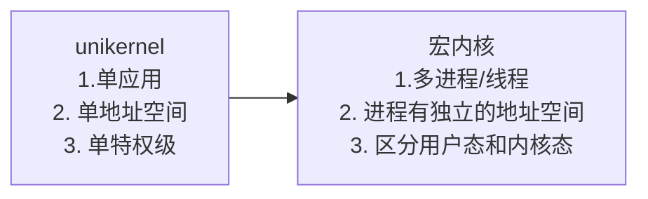
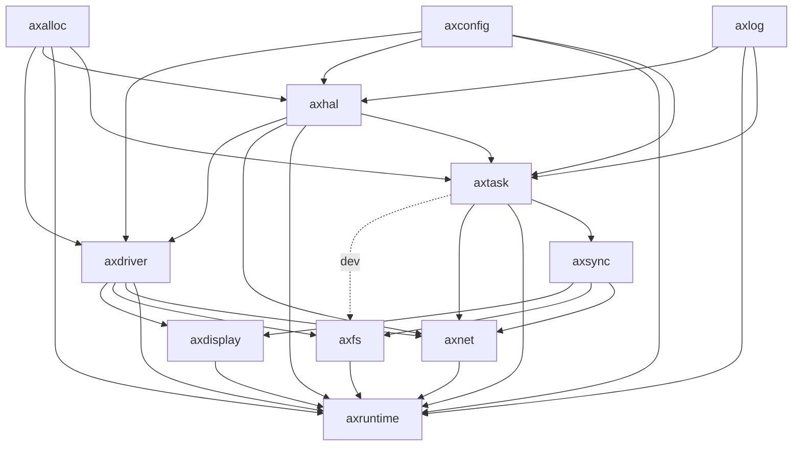
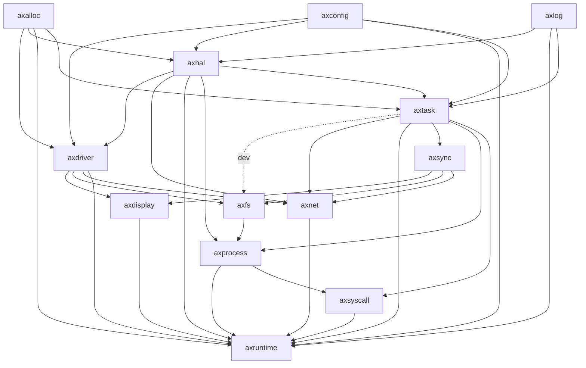
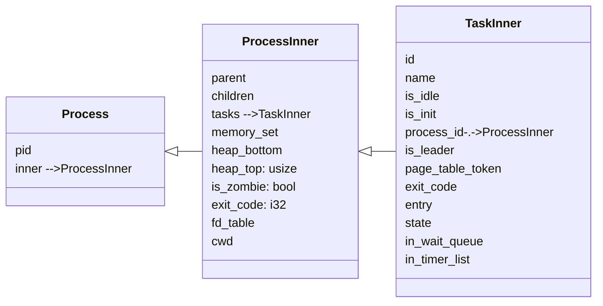
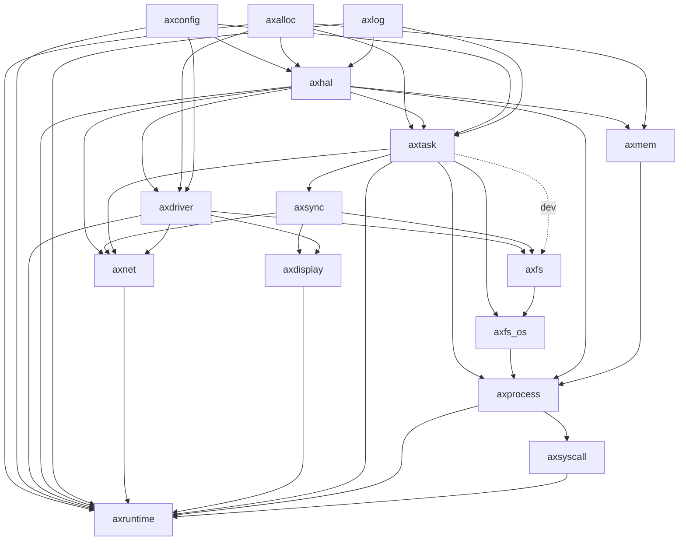
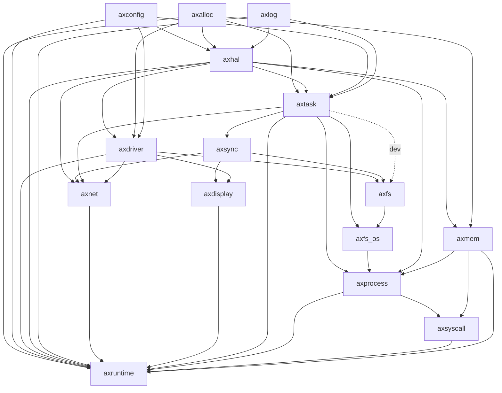
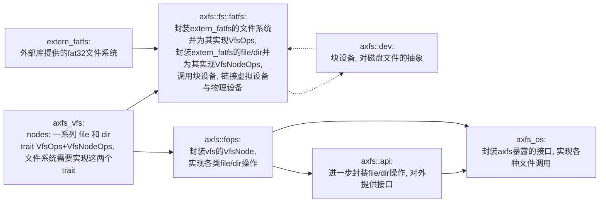
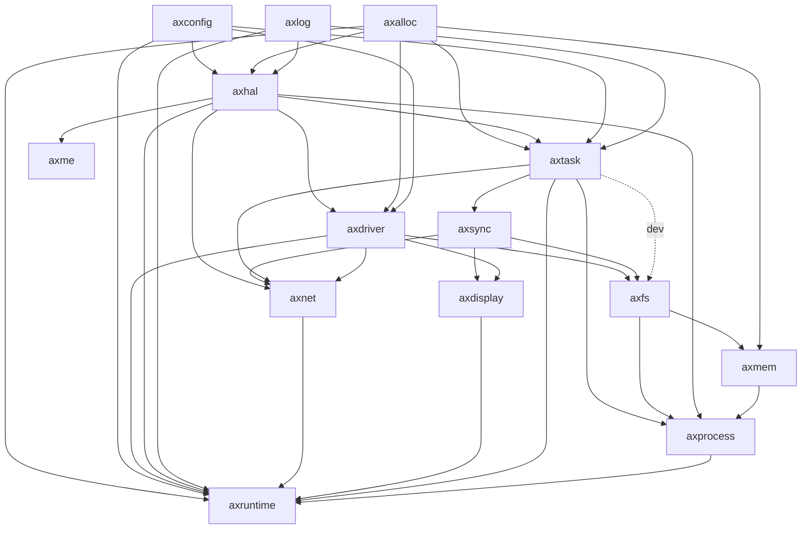

# Starry初赛阶段开发与设计报告

## 1. 开发流程、迭代计划

我们的开发以开源项目ArceOS为基础。

### 1.1 ArceOS

- 内核组件 + 组件化的OS框架 = 不同形态的OS kernel
  - 提供了一套组件化的操作系统框架
  - 提供各种内核组件的实现
    - 各种内核组件可在没有OS kernel的情况下独立运行
      - 如filesystem, network stack等内核组件可以在裸机或用户态以库的形式运行
      - 各种设备驱动等内核组件可以在裸机上运行
  - 理想情况下可以通过选择组件构成unikernel/normal kernel/micro kernel
  - 实际上在我们开始实验时它还只支持unikernel
    - 只运行一个用户程序
    - 用户程序与内核链接为同一镜像
    - 不区分地址空间与特权级
    - 安全性由底层 hypervisor 保证

### 1.2 ArceOS整体架构


#### crates

- 与 OS 的设计无关的公共模块
  - linked_list
  - page_table
  - allocator
  - scheduler
  - drivers
  - ...

#### modules

- 与 OS 的设计紧耦合
  - axtask
  - axnet
- 对 crates 的选取与包装:
  - axalloc：
  - axdriver
- 分为必选和可选
  - 必选模块
    - axruntime：启动、初始化、模块总体管控
    - axhal：硬件抽象层
    - axlog：打印日志
  - 可选模块
    - axalloc：动态内存分配
    - axtask：多任务 (线程)
    - axdriver：设备驱动 (如网络、磁盘)
    - axnet：网络

### 1.3 初赛任务、从ArceOS到Starry

#### 1.3.1 阶段一：阅读ArceOS源码

- 了解ArceOS的模块组成、各模块作用
- 了解ArceOS的具体执行过程
- 对比ArceOS与rCore

#### 1.3.1 阶段二：从unikernel到normal kernel



1. 分离用户态

- rcore：RustSBI运行在M态，通过切换到内核所在start代码进入S态。内核通过调用`__restore`函数转换到U态，运行应用程序。因此应用程序运行在U态，而内核运行在S态。 应用程序通过调用`ecall`触发CPU切换到S态，进入`trap_handler`。
- acreos：RustSBI运行在M态，通过切换到内核所在start代码进入S态。内核执行应用程序时也未改变`sstatus`，因此跳转到应用程序之后仍然在S态。给定的应用程序示例(如`yiele`程序)并未调用`ecall`，而是直接调用内核的函数接口，故未发生特权级切换。

> `exception`程序的`ebreak`并未导致特权级切换，只是触发了一个S态下的异常。

- 为了实现初赛要求的各种系统调用，我们如果想要保证应用程序运行在U态下，因此就需要实现Trap切换。

  在`ArceOS`中，关于`trap`的切换实现在`modules/axhal/src/riscv/trap.S`，这里实现的是一个完整的切换流程，即包括了从用户态进入内核态与从内核态进入用户态。

  但是我们最开始启动内核并且运行应用程序时，需要放置初始化的`Trap`上席文，并且从内核的S态进入到U态，此时原先的`trap.S`无法满足要求，因此需要手动写一个切换函数。

  `ArceOS`的启动任务逻辑如下：

  1. 每一个`task`在初始化时都会指定一个入口函数`task_entry`，同时在`entry`中指定其初始运行的函数。

     ```rust
     pub fn new<F>(
         entry: F,
         name: &'static str,
         stack_size: usize,
         process_id: u64,
         page_table_token: usize,
     ) -> AxTaskRef
     where
     F: FnOnce() + Send + 'static,
     {
         let mut t = Self::new_common(TaskId::new(), name, process_id, page_table_token);
         t.set_leader(true);
         let kstack = TaskStack::alloc(align_up_4k(stack_size));
         t.entry = Some(Box::into_raw(Box::new(entry)));
         t.ctx.get_mut().init(task_entry as usize, kstack.top());
         t.kstack = Some(kstack);
         if name == "idle" {
             t.is_idle = true;
         }
         Arc::new(AxTask::new(t))
     }
     ```

  2. 当任务被调度准备执行时，会跳转到`task_entry`。此时需要根据任务的性质进行判断。

     * 若任务是运行在内核态，即是gc或idle任务，或是微内核架构下的用户程序，则此时内核不需要切换特权级，可以直接通过运行`entry()`来启动该任务。
     * 若任务运行在用户态，即是宏内核架构下的用户程序，则此时需要手写一个特权级切换函数，在`sepc`中写入启动函数的地址，通过`sret`启动，即是下文的`first_into_user`函数。

     ```rust
     ///modules/axtask/src/task.rs
     
     /// 初始化主进程的trap上下文
     #[no_mangle]
     // #[cfg(feature = "user")]
     fn first_into_user(kernel_sp: usize, frame_base: usize) -> ! {
         let trap_frame_size = core::mem::size_of::<TrapFrame>();
         let kernel_base = kernel_sp - trap_frame_size;
         unsafe {
             asm::sfence_vma_all();
             core::arch::asm!(
                 r"
                 mv      sp, {frame_base}
                 LDR     gp, sp, 2                   // load user gp and tp
                 LDR     t0, sp, 3
                 mv      t1, {kernel_base}
                 STR     tp, t1, 3                   // save supervisor tp，注意是存储到内核栈上而不是sp中
                 mv      tp, t0                      // tp：线程指针
                 csrw    sscratch, {kernel_sp}       // put supervisor sp to scratch
                 LDR     t0, sp, 31
                 LDR     t1, sp, 32
                 csrw    sepc, t0
                 csrw    sstatus, t1
                 POP_GENERAL_REGS
                 LDR     sp, sp, 1
                 sret
             ",
                 frame_base = in(reg) frame_base,
                 kernel_sp = in(reg) kernel_sp,
                 kernel_base = in(reg) kernel_base,
             );
         };
         core::panic!("already in user mode!")
     }
     
     #[no_mangle]
     /// 本线程将会执行的函数
     extern "C" fn task_entry() -> ! {
         // release the lock that was implicitly held across the reschedule
         unsafe { crate::RUN_QUEUE.force_unlock() };
         axhal::arch::enable_irqs();
         let task: CurrentTask = crate::current();
         if let Some(entry) = task.entry {
             if task.process_id == KERNEL_PROCESS_ID {
                 // 是内核态下运行任务，直接执行即可
                 unsafe { Box::from_raw(entry)() };
             } else {
                 // 需要通过切换特权级进入到对应的应用程序
                 let kernel_sp = task.get_kernel_stack_top().unwrap();
                 let frame_address = task.trap_frame.get();
                 // 切换页表已经在switch实现了
                 first_into_user(kernel_sp, frame_address as usize);
             }
         }
         // 任务执行完成，释放自我
         unreachable!("test!");
         // crate::exit(0);
     ```

2. 分离页表，引入虚拟地址

   为了性能和方便性起见，`StarryOS`实现的是单页表机制，即当用户程序`trap`入内核态时不会切换地址空间。

   在这种架构下，用户态下的地址空间建立流程如下：

   1. 拷贝原先内核地址空间的全部内容，使得在用户地址空间下，内核依旧可以访问自身的代码与数据。
   2. 通过用户程序的ELF文件插入对应的代码和数据，从而完成用户地址空间创建。
   3. 当初始化进入用户程序，即上文的`first_into_user`时，则切换`satp`寄存器，切换到对应用户地址空间。
   4. 当在内核态进行任务调度切换时，检查`satp`是否要进行切换。

3. 建立进程与线程的抽象


#### 1.3.2 阶段三：实现初赛syscall

1. 进程管理模块

2. 内存管理模块

3. 文件系统模块


​	这三个模块没有明确的先后顺序，彼此之间有很大的相互依赖的关系，例如在实现进程和地址空间后文件系统才有条件实现open/read/write等调用，内存管理模块的mmap等系统调用又依赖于文件系统的fstat等调用，故在开发过程中是并行的关系。

## 2. 设计与实现

### 2.1 整体架构

1. ArceOS:




这里简单介绍一下部分模块。

axruntime是内核启动的入口，调用了很多模块的初始化程序。在内核启动时，它会根据传入的feature信息选择性编译，从而选择不同模块组成内核。

axfs是文件管理模块，它提供了各种对文件操作的接口。

axsync是同步原语，主要提供了一个应用非常多的线程锁mutex。

axtask是线程管理模块，负责多线程的调度。

axhal是Arceos对特定硬件架构(如ARM/Riscv)和平台的抽象和驱动支持。

axdriver模块是一个通用的设备驱动框架，axhal模块下的不同平台驱动基于此框架开发。

axalloc提供内存管理，有一个全局的页帧分配器。

axlog提供日志服务。

axconfig根据平台的不同定义了一些常量不同的值，例如内核基址，用户基址，内核数量等。

2. Starry:



在原有module的基础之上，添加了`axprocess`与`axsyscall`两个上层模块。

其中`axprocess`维护了一个进程管理模块，进程的抽象大致如下




在开发文件系统时，在原有的`axfs`模块之上临时添加了一层抽象`axfs_os`，对axfs提供的接口做封装，实现文件描述符、FileIO特征等。



最终的模块依赖模型如下，右下角是新创建的四个模块，除此之外还对axruntime/axtask/axfs等模块做了较大程度的修改。




### 2.2 进程管理

进程管理是一个OS设计中较为核心的部分。`Arceos`的原有设计指向`unikernel`，并未引入进程的概念，原有的`axtask`模块承担的更像是线程的任务。为了适配宏内核，需要引入进程的概念。而在如何引进这方面，我们团队成员有两种不同的意见：

1. 为了最大程度保留`ArceOs`原有内容，计划将进程和线程分离，在`axtask`上额外加入一个模块`axprocess`，作为进程模块，即类似于`rCore`的进程控制块与线程控制块分离的结构。
2. 为了尽可能贴近`linux`的设计理念，决定将进程和线程统一在一个数据结构中，类似于`pthread`的设计理念。因此设计过程中会避开原有的`axtask`模块，自行设计一个新的模块，承担进程与线程的功能。

在开始阶段，经过讨论后我们决定保留上述两种意见，即两种设计架构的内核同时开发，后续再依情况进行调整。

#### 2.2.1 线程和进程分离

根据分离的思想，为线程和进程分别设计了如下模块：

```rust
// 线程模块，继承原有axtask模块
pub struct TaskInner {
    id: TaskId,
    name: &'static str,
    is_idle: bool,
    is_init: bool,
    /// 所属进程
    process_id: u64,
    /// 是否是所属进程下的主线程
    is_leader: AtomicBool,
    /// 所包含的页表的token，内核的token统一为0
    page_table_token: usize,
    exit_code: AtomicI32,
    entry: Option<*mut dyn FnOnce()>,
    state: AtomicU8,

    in_wait_queue: AtomicBool,
    in_timer_list: AtomicBool,

    #[cfg(feature = "preempt")]
    need_resched: AtomicBool,
    #[cfg(feature = "preempt")]
    preempt_disable_count: AtomicUsize,
    /// 存储当前线程的TrapContext
    pub trap_frame: UnsafeCell<TrapFrame>,
    /// 对应内核栈
    kstack: Option<TaskStack>,
    /// 对应任务上下文
    ctx: UnsafeCell<TaskContext>,
    time: UnsafeCell<TimeStat>,
}

// 进程模块，存储于axprocess中
/// 进程的的数据结构
pub struct Process {
    /// 进程的pid和初始化的线程的tid是一样的
    pub pid: u64,
    pub inner: SpinNoIrq<ProcessInner>,
}

pub struct ProcessInner {
    /// 父进程的进程号
    pub parent: u64,
    /// 子进程
    pub children: Vec<Arc<Process>>,
    /// 子任务
    pub tasks: Vec<AxTaskRef>,
    /// 地址空间，由于存在地址空间共享，因此设计为Arc类型
    pub memory_set: Arc<SpinNoIrq<MemorySet>>,
    /// 用户堆基址，任何时候堆顶都不能比这个值小，理论上讲是一个常量
    pub heap_bottom: usize,
    /// 当前用户堆的堆顶，不能小于基址，不能大于基址加堆的最大大小
    pub heap_top: usize,
    /// 进程状态
    pub is_zombie: bool,
    /// 退出状态码
    pub exit_code: i32,
    /// 文件描述符表
    pub fd_table: Vec<Option<Arc<dyn FileIO>>>,
    /// 进程工作目录
    pub cwd: String,
}
```

依据模块化的思想，我们可以将进程视为一个容器，**存储了各类运行时资源，包括虚存、文件描述符、线程、信号等**。

在该种设计理念下，进程仅是对上述资源的一个统一与包装。因此可以在后期通过添加`feature`等方式将进程作为一个可插拔模块，使得内核在宏内核架构与微内核架构中随时进行切换。

该种设计的优势如下：

* 保留了`ArceOS`的结构，可以较为方便地与其他同学开发结果进行结合
* 耦合度低，因此可以使内核较为方便地在不同模式间进行切换

在该种设计架构下，接受外来系统调用时，需要将部分对线程进行操作的系统调用转发给进程。进程收到该系统调用之后，再对当前进程下正在运行的线程进行相应的操作。实例为`yield`，`exit`等。

#### 2.2.2 线程和进程统一

根据统一的思想，对进程和线程的抽象大致如下：

```rust
pub struct Task {
    pub pid: usize,
    pub tid: usize,
    pub(crate) state: AtomicU8,
    pub(crate) ctx: UnsafeCell<TaskContext>,

    pub(crate) memory_set: Arc<SpinNoIrq<MemorySet>>,

    /// TaskStack is simply a pointer to memory in memory_set.
    /// Kernel stack is mapped in "free memory" region.
    pub(crate) kstack: TaskStack,
    /// User stack is mapped in user space (highest address)
    pub(crate) ustack: VirtAddr,

    #[cfg(feature = "fs")]
    pub(crate) fd_table: SpinNoIrq<FdList>,
}
```

这样实现的优势主要有：

- 简单易用。通过使用同一结构体表示进程和线程，从用户态和系统调用的角度看，操作进程和线程的接口是一致的。不需要区分是操作进程还是操作线程，大大简化了设计和使用。
- 代码复用。很多与进程和线程相关的代码，如调度、同步等都可以在同一个结构体下复用，减少了重复代码。

劣势主要是：

- 到后期结构体比较庞大，包含的字段偏多，维护难度大。
- 进程和线程具有本质的区别，抽象成一致的结构体会在一定程度上隐藏这些区别，容易造成混淆。
- 某些字段只适用于进程或线程，如果放在同一个结构体内，当操作进程或线程时，需要进行额外的判断和处理。

### 2.3 内存管理

关于内存管理部分，`StarryOS`设计基本沿用了`rCore`的理念，即通过页表与地址段的方式来记录地址空间。

```rust
/// 地址空间实现
pub struct MemorySet {
    pub page_table: PageTable,
    pub areas: Vec<MapArea>,
}

pub struct MapArea {
    /// global page本身就是多个页面的，且存储了起始地址
    pub start_va: VirtAddr,
    pub pages: GlobalPage,
    pub flags: MappingFlags,
}
```

地址空间支持如下功能：

1. 多级分页，支持三级与四级分页机制

2. 连续分配物理页面：可以分配连续的物理页面，避免出现跨页的现象

3. 单页表机制：当任务trap入内核时，并未改变stap寄存器，而是沿用原先进程的地址空间。

   该方法的优点在于：

   1. 可以减小切换地址空间与刷新页表带来的时间开销
   2. 内核访问用户地址空间数据时不需要额外手动查询页表（Point）

### 2.4 文件管理

文件管理部分由四个模块组成，分别是extern_crates/fatfs、crates/axfs_vfs、modules/axfs和modules/axfs_os。它们之间的关系大致如下图：



左上角的fatfs是外部库提供的fat32文件系统；

左下角的axfs_vfs是一个crate，提供对文件和目录的抽象，OS使用的文件系统需要实现它的VfsOps trait，同时文件系统的file/directory需要实现它的VfsNodeOps trait；

中间四个部分是axfs这个module中的不同模块，axfs::fatfs作为中介连接了文件系统、vfs、块设备三个模块，它封装了外部的fat32提供的文件系统和file/directory，并为它们实现axfs_vfs中的对应trait，同时调用了axfs::dev对硬件进行操作；axfs::fops封装了ax_vfs中的各种VfsNode操作，向上提供给axfs::api模块暴露给外部；

右侧的axfs_os则封装从axfs中暴露出的各种接口，实现不同的功能。

### 2.5 syscall实现

在三个模块搭建完成后，具体的syscall的实现就很简单，只需要调用已经写好的各种接口即可。

### 2.6 线上测试

线上的测试环境无网络连接，所有的依赖项都需要添加到本地并使用--offline参数编译。

由于ArceOS本身作为unikernel功能已经十分多样，大量的modules和crates依赖了很多外部项目，而外部项目本身也会依赖新的外部项目，将所有需要用到的外部项目本地化工作量很大。

```shell
# 当前编译所需的外部库
$ ll extern_crates/
adler-1.0.2/
autocfg-1.1.0/
bit_field-0.10.2/
bitflags-2.1.0/
bitflags_1-1.3.2/
bitmap-allocator-98b9ef9bd0253b32/
buddy_system_allocator-0.9.0/
......
xmas-elf-0.9.0/
zero-0.1.3/
zerocopy-0.6.1/
zerocopy-derive-0.3.2/
# 共65项
```

> 所依赖的外部库数量为65+，对比之下学长的maturin所需的外部项目仅有9个。

外部库的本地化大致分为四步:

1. 清空~/.cargo下的缓存，执行一次Starry的编译运行；

2. 将~/.cargo下git和registry中新下载的项目拷贝到Starry项目中的extern_crates目录下；

3. 重命名同名但版本不同的包；

   1. 直接将其中一个重命名，以 syn-1.0.109 和 syn-2.0.13 为例，修改前者的Cargo.toml文件，将其重命名为syn_1，并将目录重命名为syn_1-1.0.109；
   2. 修改所有依赖项包含`syn = "1.*"`的项目，主要通过下面的脚本实现：

   ```python
   # 用法: python rename_crate.py <old_crate_name> <new_crate_name> dir_path
   # 作用: 例如extern_crates目录下有两个crate: syn-1.0.109 和 syn-2.0.13
   #      但是同一个工作目录下中只能有一个syn，因此需要将其中一个重命名,例如将syn-1.0.109重命名为syn_1,此时依赖syn-1.0.109的项目中的`use syn;`语句需要修改为`use syn_1`; `syn_1::xxx;`需要修改为`syn_1::xxx;`
   #      这个脚本用来修改这些语句，暂时使用还比较麻烦，需要手动指定每一个引用syn-1.0.109的项目的路径
   import os
   import re
   import sys
   # 项目根目录
   root_dir = os.path.abspath(os.path.join(os.path.dirname(__file__), '..'))
   # 要修改的 crate 名称
   old_crate_name = sys.argv[1]
   new_crate_name = sys.argv[2]
   # 依赖这个 crate 的 项目路径
   dir_path = sys.argv[3]
   
   # 遍历dir_path下所有文件，
   # 1.将.rs文件中的old_crate_name替换为new_crate_name；
   # 2.将cargo.toml文件中的依赖名称修改为new_crate_name
   for root, dirs, files in os.walk(dir_path):
       for file in files:
           if file.endswith('.rs'):
               with open(os.path.join(root, file), 'r', encoding='utf-8') as f:
                   content = f.read()
                   # 1. `use old_crate_name`
                   pattern = re.compile(rf'use\s+{old_crate_name}\s*;')
                   content = re.sub(pattern, f'use {new_crate_name};', content)
                   # 2. `use old_crate_name::xxx`
                   pattern = re.compile(rf'use\s+{old_crate_name}::')
                   content = re.sub(pattern, f'use {new_crate_name}::', content)
                   # 3. `old_crate_name::xxx`
                   pattern = re.compile(rf'{old_crate_name}::')
                   content = re.sub(pattern, f'{new_crate_name}::', content)
                   with open(os.path.join(root, file), 'w', encoding='utf-8') as f:
                       f.write(content)
           elif file == 'Cargo.toml':
               with open(os.path.join(root, file), 'r', encoding='utf-8') as f:
                   content = f.read()
                   # 1. `old_crate_name = "xxx"`
                   pattern = re.compile(rf'{old_crate_name}\s*=\s*"\S+"')
                   content = re.sub(pattern, f'{new_crate_name} = "{{ path = \\"../{old_crate_name}\\" }}"', content)
                   # 2. `old_crate_name = { version = "xxx" }`
                   pattern = re.compile(rf'{old_crate_name}\s*=\s*{{\s*version\s*=\s*"\S+"\s*}}')
                   content = re.sub(pattern, f'{new_crate_name} = {{ path = "../{old_crate_name}" }}', content)
                   # 3. dependencies.old_crate_name
                   pattern = re.compile(rf'dependencies\.{old_crate_name}')
                   content = re.sub(pattern, f'dependencies.{new_crate_name}', content)
                   with open(os.path.join(root, file), 'w', encoding='utf-8') as f:
                       f.write(content)
   
   ```

4. 将所有cargo.toml中的依赖重定向到本地。

   主要通过下面的脚本实现：

   ```python
   # 用法：python localize.py dep_name
   # 作用：将所有依赖dep_name的项目的依赖路径修改为本地路径, 需要提前将.cargo中的依赖库移动到extern_crates目录下
   import os
   import re
   import sys
   # 项目根目录
   root_dir = os.path.abspath(os.path.join(os.path.dirname(__file__), '..'))
   # 遍历所有文件，查找cargo.toml文件
   cargo_toml_list = []
   for root, dirs, files in os.walk(root_dir):
       for file in files:
           if file == 'Cargo.toml':
               cargo_toml_list.append(os.path.join(root, file))
   # 对于一个依赖项dep_name，其依赖项的版本号在Cargo.toml文件中的格式为：
   # 1. dep_name = "version"
   # 2. dep_name = { version = "version", ... }
   # 3. dep_name = { path = "path", ... }     (我们的目的是转换为这种情况)
   # 4. [dependencies.dep_name]\nversion = "version"
   # 4. [dependencies.dep_name]\npath = "path" (我们的目的是转换为这种情况)
   dep_name = sys.argv[1]
   print(dep_name)
   # 在root_dir下的extern_crates目录下，找到前缀为dep_name的目录
   dep_local_path = ''
   has_dep = False
   for root, dirs, files in os.walk(os.path.join(root_dir, 'extern_crates')):
       for dir in dirs:
           if dir.startswith(f'{dep_name}-'):
               if has_dep:
                   print('Error: More than one dependency found!')
                   print('Please check the extern_crates directory.')
                   exit(1)
               dep_local_path = os.path.join(root, dir)
               has_dep = True
   print(dep_local_path)
   # 查找所有包含依赖项dep_name的Cargo.toml文件，并将其依赖项的版本号转换为依赖于本地路径
   for cargo_toml in cargo_toml_list:
       # 计算dep_local_path相对于cargo_toml的路径
       dep_local_path_rel = os.path.relpath(dep_local_path, os.path.dirname(cargo_toml))
       with open(cargo_toml, 'r', encoding='utf-8') as f:
           content = f.read()
           # 1. dep_name = "version"
           pattern = re.compile(rf'{dep_name}\s*=\s*"\d+(\.((\d+)|\*))*"')
           content = re.sub(pattern, f'{dep_name} = {{ path = "{dep_local_path_rel}" }}', content)
           # 2. dep_name = { version = "version", ... }
           pattern = re.compile(rf'{dep_name}\s*=\s*{{\s*version\s*=\s*"\d+(\.\d+)*"')
           content = re.sub(pattern, f'{dep_name} = {{ path = "{dep_local_path_rel}"', content)
           # 3. dep_name = { path = "path", ... } (把之前一些手动修改的path标准化一下)
           pattern = re.compile(rf'{dep_name}\s*=\s*{{\s*path\s*=\s*"(.+?)"')
           content = re.sub(pattern, f'{dep_name} = {{ path = "{dep_local_path_rel}"', content)
           # 4. [dependencies.dep_name]\nversion = "version"
           pattern = re.compile(rf'\.{dep_name}\]\s*version\s*=\s*"\d+(\.((\d+)|\*))*"')
           content = re.sub(pattern, f'.{dep_name}]\npath = "{dep_local_path_rel}"', content)
           # 5. [dependencies.dep_name]\npath = "path"
           pattern = re.compile(rf'\.{dep_name}\]\s*path\s*=\s*"(.+?)"')
           content = re.sub(pattern, f'.{dep_name}]\npath = "{dep_local_path_rel}"', content)
           with open(cargo_toml, 'w', encoding='utf-8') as f:
               f.write(content)
   ```

   > 这个过程实际上还是需要大量手动重复操作，后续我们使用了更加便捷的方案。

## 3. 问题和解决

### 3.1 循环依赖

由于ArceOS的模块化设计，不同的modules之间会形成以module为单位的依赖关系，相较于以文件为单位的依赖关系而言更容易产生循环依赖的问题。

> 一个例子：假如一个项目中有A、B、C三个文件，A依赖B、B依赖C，不会有任何问题；但如果三个文件被解耦到两个不同的项目 M和N中，M中有A和C，N中有B，那么M和N之间就会发生相互依赖。
>
> 这种情况在我们的开发过程中并不少见。

参考ArceOS的依赖图：


如果我们想要将axtask扩展为一个可以支持进程和线程的模块，那么由于进程对文件系统的自然的依赖(文件描述符表)，在这张图中便会形成一个axfs->axsync->axtask->axfs的循环依赖关系。

事实上，这也是我们最终抛弃"线程和进程统一"思路的原因；

> 回到前面对应的部分，可以看到我们在线程和进程统一使用的是忙等锁而非axsync提供的mutex锁。

在不能发生循环依赖的限制下，axprocess与axtask的解耦也并不trivial，因为我们需要保证两个模块之间的依赖关系是单向的，即只能由其中一个模块调用另一个模块的接口，这便会产生一些小问题，例如主线程退出时如何在不调用进程接口的情况下关闭掉所属的进程。

## 4. 合并与重构

在初赛的结束阶段，我们对同步进行开发的两个os项目进行了合并。

在合并之后，我们取消了axfs_os和axsyscall两个module，前者作为一个临时模块，在功能较为完善后被并入了axfs；后者则是因为考虑到syscall所属层次更偏向于用户库，因而转移到了ulib目录下。此时的项目依赖关系如下：



整体结构图如图：


在合并之后，我们还做了一些新的工作，例如支持动态链接、添加信号量、改进编译过程等，但不属于区域赛阶段的内容，在此不再赘述。
