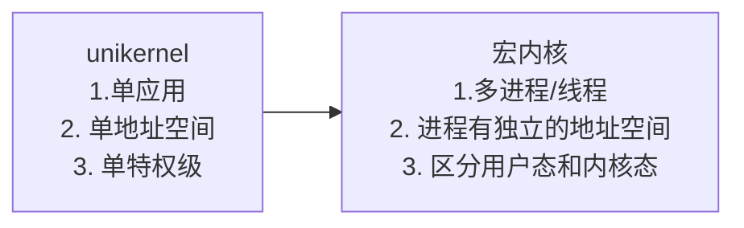
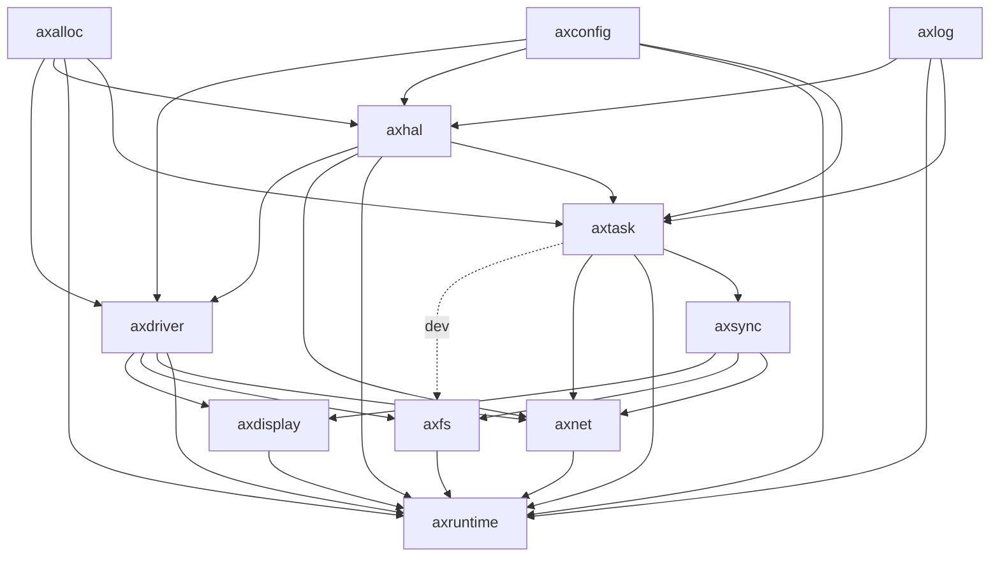
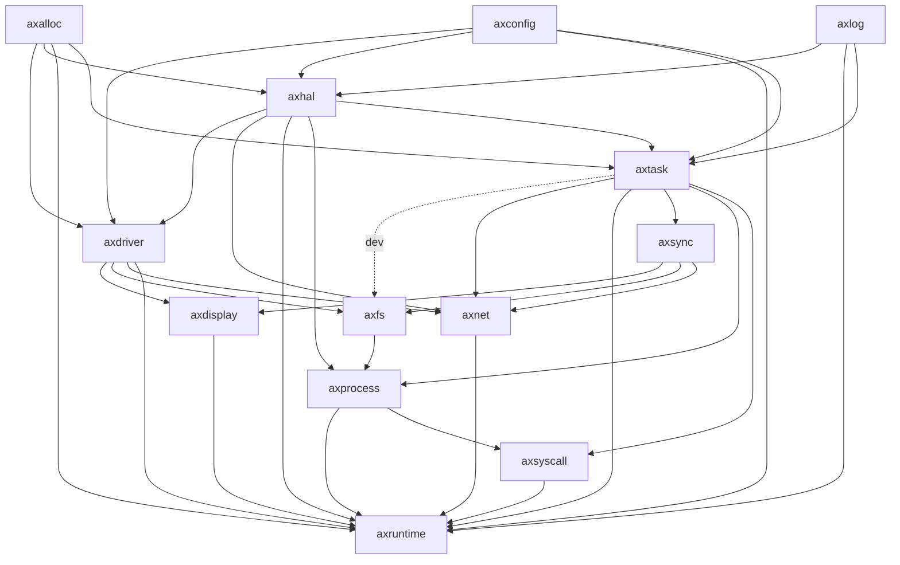
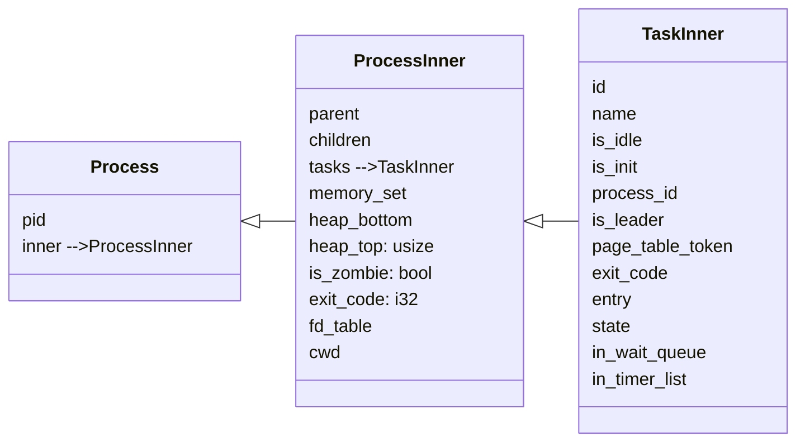
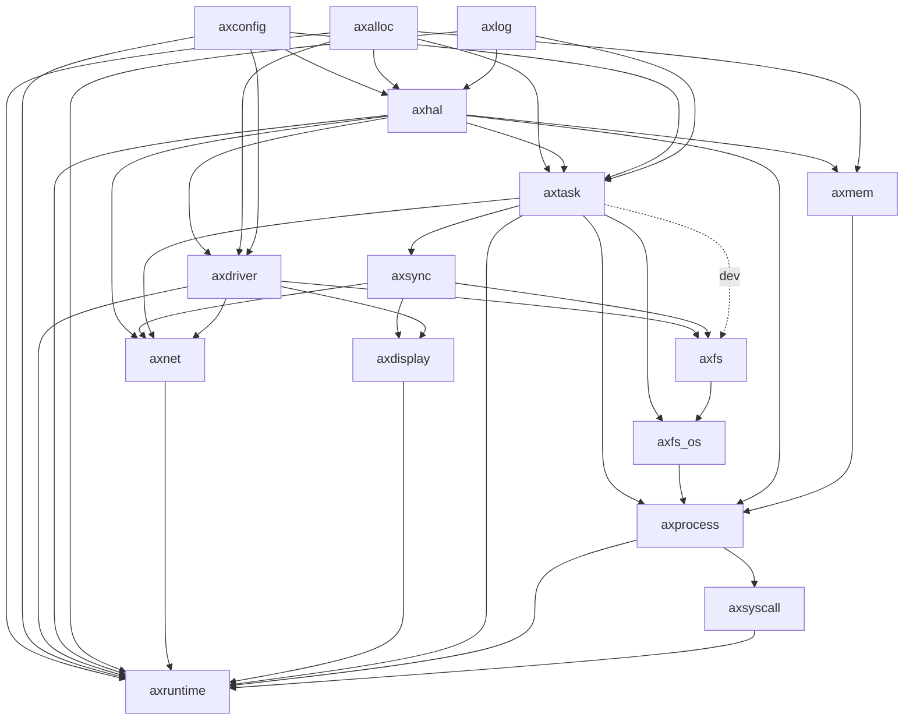

# Starry开发与设计报告

## 1. 开发流程、迭代计划

我们的开发以开源项目ArceOS为基础。

### 1.1 ArceOS

- 内核组件 + 组件化的OS框架 = 不同形态的OS kernel
  - 提供了一套组件化的操作系统框架
  - 提供各种内核组件的实现
    - 各种内核组件可在没有OS kernel的情况下独立运行
      - 如filesystem, network stack等内核组件可以在裸机或用户态以库的形式运行
      - 各种设备驱动等内核组件可以在裸机上运行
  - 理想情况下可以通过选择组件构成unikernel/normal kernel/micro kernel
  - 实际上在我们开始实验时它还只支持unikernel
    - 只运行一个用户程序
    - 用户程序与内核链接为同一镜像
    - 不区分地址空间与特权级
    - 安全性由底层 hypervisor 保证

### 1.2 ArceOS整体架构

#### crates

- 与 OS 的设计无关的公共模块
  - linked_list
  - page_table
  - allocator
  - scheduler
  - drivers
  - ...

#### modules

- 与 OS 的设计紧耦合
  - axtask
  - axnet
- 对 crates 的选取与包装:
  - axalloc：
  - axdriver
- 分为必选和可选
  - 必选模块
    - axruntime：启动、初始化、模块总体管控
    - axhal：硬件抽象层
    - axlog：打印日志
  - 可选模块
    - axalloc：动态内存分配
    - axtask：多任务 (线程)
    - axdriver：设备驱动 (如网络、磁盘)
    - axnet：网络

### 1.3 初赛任务、从ArceOS到Starry

#### 1.3.1 阶段一：阅读ArceOS源码

- 了解ArceOS的模块组成、各模块作用
- 了解ArceOS的具体执行过程
- 对比ArceOS与rCore

#### 1.3.1 阶段二：从unikernel到normal kernel

1. 分离用户态

- rcore：RustSBI运行在M态，通过切换到内核所在start代码进入S态。内核通过调用`__restore`函数转换到U态，运行应用程序。因此应用程序运行在U态，而内核运行在S态。 应用程序通过调用`ecall`触发CPU切换到S态，进入`trap_handler`。
- acreos：RustSBI运行在M态，通过切换到内核所在start代码进入S态。内核执行应用程序时也未改变`sstatus`，因此跳转到应用程序之后仍然在S态。给定的应用程序示例(如`yiele`程序)并未调用`ecall`，而是直接调用内核的函数接口，故未发生特权级切换。

> `exception`程序的`ebreak`并未导致特权级切换，只是触发了一个S态下的异常。

- 为了实现初赛要求的各种系统调用，我们如果想要保证应用程序运行在U态下，需要手动添加类似rcore的`__restore`函数进行特权级切换，通过`ecall`从应用态进入内核态。

2. 分离页表，引入虚拟地址

   TODO

3. 建立进程与线程的抽象

   TODO

#### 1.3.2 阶段三：初赛syscall的实现

1. 进程管理

   TODO

2. 内存管理

   TODO

3. 文件系统

   TODO

## 2. 设计与实现

### 2.1 整体架构

1. ArceOS:

2. Starry:

在原有module的基础之上，添加了`axprocess`与`axsyscall`两个上层模块。

其中`axprocess`维护了一个进程管理模块，进程的抽象大致如下

在开发文件系统时，在原有的`axfs`模块之上临时添加了一层抽象`axfs-os`，对axfs提供的接口做封装，实现文件描述符、File特征等。

### 2.2 进程管理

TODO

### 2.3 内存管理

TODO

### 2.4 文件系统

TODO

### 2.5 自动化测试

TODO

### 2.6 线上测试

TODO

## 3. 部分遇到的问题

### 1. 循环依赖

TODO

### 2. Openat遇到较大的文件时发生错误

TODO

### 3. GetDirent对其他syscall产生了奇怪的影响

